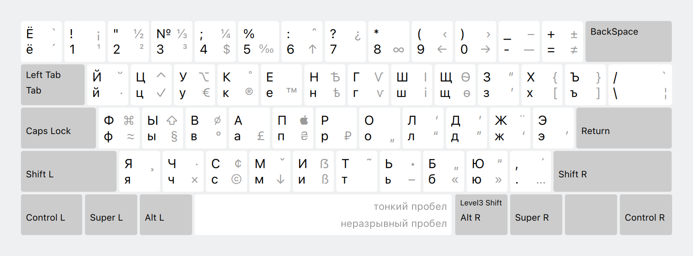

# Типографская раскладка Ильи Бирмана для Linux

Этот репозиторий содержит адаптацию русской и английской [типографской раскладки Ильи Бирмана](http://ilyabirman.ru/projects/typography-layout/) версии 3.7 для систем на базе Linux и X.org.

Раскладки протестированы в KDE 6.3.3, а также в suckless dwm.

## Фичи раскладки




Эта раскладка позволяет вводить полезные символы, используя правый <kbd>Alt</kbd> (называемый AltGr). Например, чтобы получить знак евро (€), вам нужно нажать <kbd>AltGr</kbd>+<kbd>У</kbd> в русском варианте или <kbd>AltGr</kbd>+<kbd>E</kbd> в английском. Дополнительный ряд символов доступен при нажатии ещё и Shift-а, например, <kbd>AltGr</kbd>+<kbd>С</kbd> даст знак копирайта (©), а <kbd>AltGr</kbd>+<kbd>Shift</kbd>+<kbd>С</kbd> даст знак цента (¢).

Как и оригинал, эта раскладка поддерживает ввод акцентов и ударений через «мёртвые клавиши», но процесс немного отличается от того, как это делается в Windows или на Маке. Например, для ввода буквы «ў» нужно нажать и отпустить <kbd>AltGr</kbd>+<kbd>Shift</kbd>+<kbd>й</kbd>, а затем <kbd>у</kbd>.

## Отличия от оригинальной раскладки Бирмана

- На <kbd>Alt</kbd>+<kbd>G</kbd> вернулась гривна (₴)
- На <kbd>Alt</kbd>+<kbd>\\</kbd> ломаная вертикальная черта (¦)
- На <kbd>Alt</kbd>+<kbd>Q</kbd> интерпункт (·). Он отличается от знака умножения по смыслу и иногда толщиной
- На <kbd>Shift</kbd>+<kbd>Alt</kbd>+<kbd>пробел</kbd> тонкий пробел (1/5 или 1/6 круглой шпации). В оригинале, как и на <kbd>Alt</kbd>+<kbd>пробел</kbd>, висит неразрывный

## Установка

1. Установите Python.

2. Скопируйте команду, приведенную ниже:

    ```
    python3 -c "import os, sys
    from urllib.request import urlopen
    p = 'https://github.com/jilotta/birman-for-xkb/archive/refs/tags/v3.7.tar.gz'
    with open('/tmp/birman.tgz','bw') as f: f.write(urlopen(p).read())" &&
    tar xf /tmp/birman.tgz -C /tmp && \
    cd /tmp/birman-for-xkb-3.7 && \
    sudo /tmp/birman-for-xkb-3.7/install.sh
    ```

3. Откройте терминал (<kbd>Ctrl</kbd>+<kbd>Alt</kbd>+<kbd>T</kbd>), вставьте команду и нажмите клавишу <kbd>Enter</kbd>.

    Эта команда установит обе раскладки в системе под названием «Russian (Typographic by Ilya Birman)» и «English (Typographic by Ilya Birman)». В конфигурации X.org они называются `ru(birman)` и `en(birman)`.
    
    Включать эти раскладки, их переключение и правый <kbd>Alt</kbd> надо самостоятельно в настройках системы. Что именно надо делать — зависит от дистрибутива.

4. Дождитесь зелёного сообщения об успехе. В процессе установки может потребоваться ввод пароля.

5. **Обязательно перезагрузитесь после установки.**
